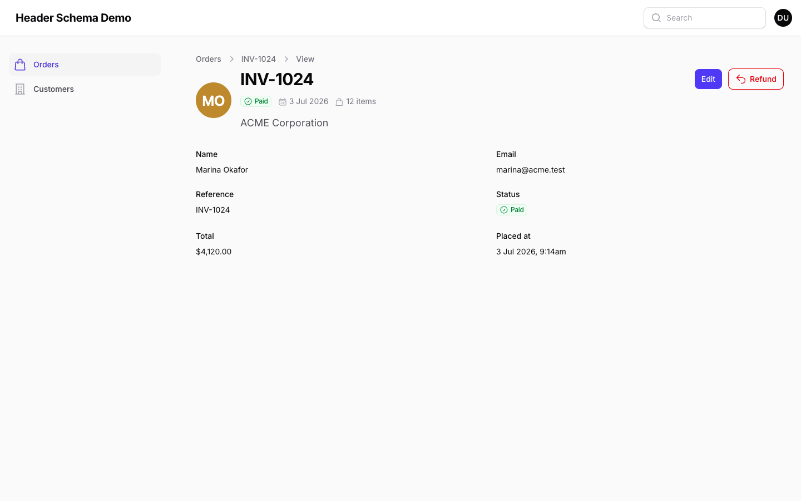
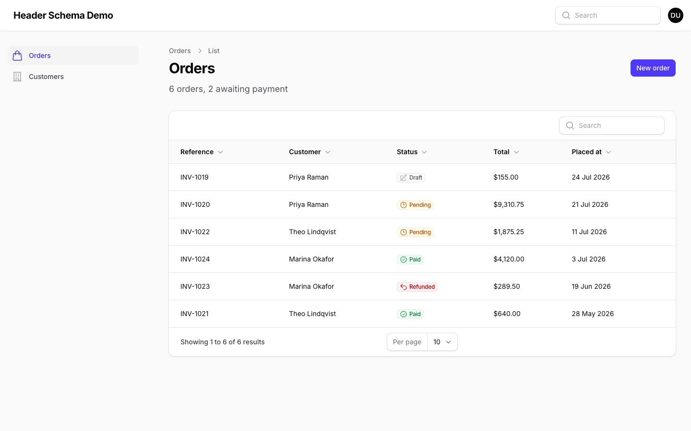
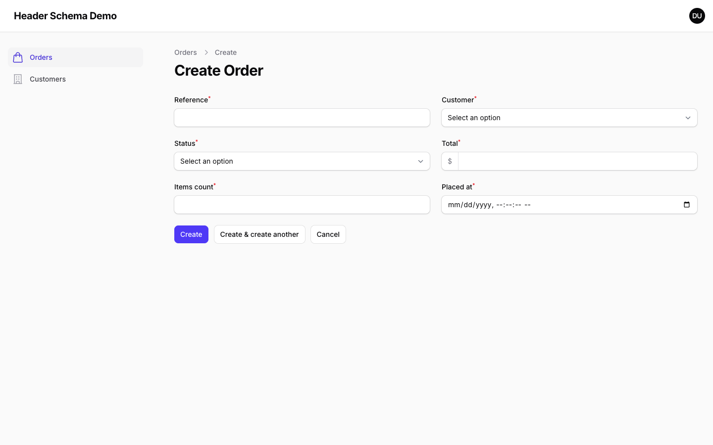
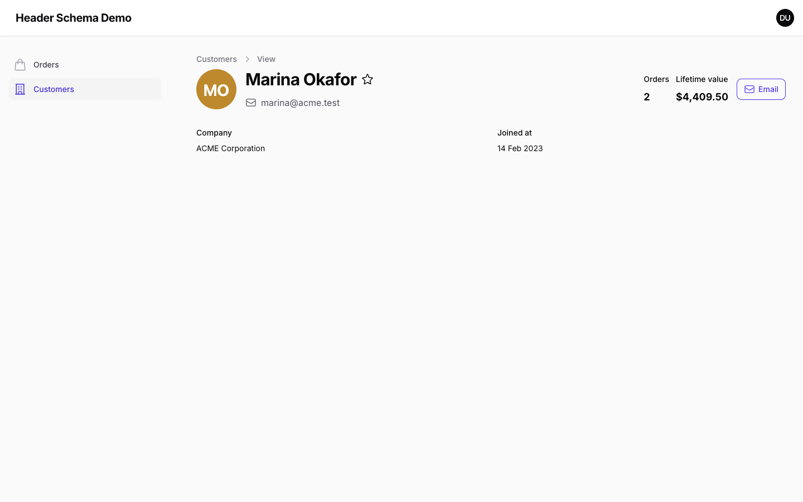
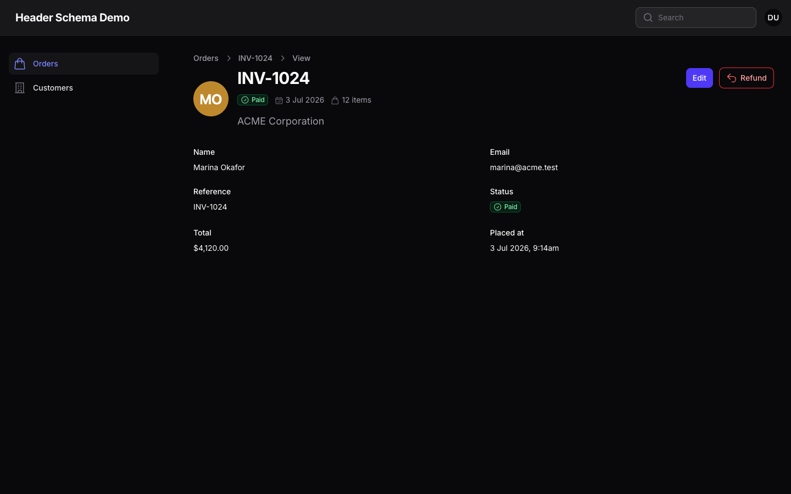

# Filament Header Schema

[](https://packagist.org/packages/vitisstudio/filament-header-schema)
[](https://github.com/vitisstudio/filament-header-schema/actions?query=workflow%3Arun-tests+branch%3Amain)
[](https://github.com/vitisstudio/filament-header-schema/actions?query=workflow%3A"Fix+PHP+code+style+issues"+branch%3Amain)
[](https://packagist.org/packages/vitisstudio/filament-header-schema)

Build the header of a Filament page with a schema instead of a Blade view.

Filament gives you `getHeading()` and `getSubheading()` for plain text, and `getHeader()` for everything else — which means dropping to a Blade view the moment you want an avatar next to the title, a status badge beside it, and a couple of totals pushed to the right. This package adds a `headerSchema()` method that sits alongside `form()` and `infolist()`, so a rich header is written the same way as the rest of the page.



```php
use Filament\Infolists\Components\TextEntry;
use Filament\Resources\Pages\ViewRecord;
use Filament\Schemas\Components\Flex;
use Filament\Schemas\Schema;
use VitisStudio\FilamentHeaderSchema\Components\HeaderSection;
use VitisStudio\FilamentHeaderSchema\Components\Heading;
use VitisStudio\FilamentHeaderSchema\Components\Subheading;
use VitisStudio\FilamentHeaderSchema\Concerns\HasHeaderSchema;

class ViewOrder extends ViewRecord
{
    use HasHeaderSchema;

    protected static string $resource = OrderResource::class;

    public function headerSchema(Schema $schema): Schema
    {
        return $schema->components([
            HeaderSection::make([
                Heading::make('customer_name'),
                Flex::make([
                    TextEntry::make('status')->badge()->hiddenLabel(),
                    TextEntry::make('reference')->hiddenLabel(),
                ]),
                Subheading::make('summary'),
            ])
                ->leading(ImageEntry::make('customer_avatar')->circular()->hiddenLabel())
                ->trailing(TextEntry::make('total')->money()->hiddenLabel()),
        ]);
    }
}
```

Everything you can put in an infolist works, because a header schema *is* a schema — entries, layouts, actions, visibility rules, the lot.

## Requirements

- PHP 8.2+
- Laravel 11.28, 12 or 13
- Filament 5.7+

## Installation

```bash
composer require vitisstudio/filament-header-schema
```

That's the whole install. There is no asset to publish and no theme change to make: the package's styles are written against Filament's own design tokens and inlined into the page head, so dark mode and custom panel colours work out of the box.

## Usage

### Generating one

```bash
php artisan make:filament-header-schema
```

It asks which resource the header belongs to, then which of that resource's pages should use it — a multi-select built from the pages the resource actually registers, so you only ever see `ListOrders`, `ViewOrder`, `EditOrder` and friends. List, view and edit are pre-selected; create is not.

The schema class lands in the resource's `Schemas` directory, next to the `OrderForm` and `OrderInfolist` Filament generates:

```
app/Filament/Resources/Orders/
├── OrderResource.php
├── Pages/
│   ├── ViewOrder.php          ← trait applied
│   └── EditOrder.php          ← trait applied
└── Schemas/
    ├── OrderForm.php
    ├── OrderInfolist.php
    └── OrderHeader.php        ← generated
```

```php
namespace App\Filament\Resources\Orders\Schemas;

use Filament\Schemas\Schema;
use VitisStudio\FilamentHeaderSchema\Components\HeaderSection;
use VitisStudio\FilamentHeaderSchema\Components\Heading;

class OrderHeader
{
    public static function configure(Schema $schema): Schema
    {
        return $schema
            ->components([
                HeaderSection::make([
                    Heading::make('reference')
                        ->default(fn ($livewire) => $livewire->getHeading()),
                    //
                ]),
            ]);
    }
}
```

The heading is seeded from the resource's record title attribute. The `->default()` matters more than it looks: one header schema serves every page of the resource, and a list page has no record to read `reference` from, so it falls back to the page's own heading. Opting a page in never leaves it with no title.

The trait finds `{Model}Header` in the resource's `Schemas` namespace by convention — nothing references it by name, so a page only has to apply the trait.

Useful options:

| Option | Effect |
|---|---|
| `--page=view --page=edit` | Skip the prompt and apply the trait to these route keys |
| `--no-pages` | Only generate the class; wire the trait up yourself |
| `--panel`, `--cluster`, `--resource-namespace` | Skip the corresponding prompt |
| `-F`, `--force` | Overwrite an existing schema class |

Applying the trait edits your page files in place, adding one import and one `use` statement. It is idempotent, and everything else in the file — formatting, docblocks, other traits — is left alone.

### Opting a page in by hand

Add the trait to any resource View, Edit or List page and define `headerSchema()`:

```php
use VitisStudio\FilamentHeaderSchema\Concerns\HasHeaderSchema;

class ViewOrder extends ViewRecord
{
    use HasHeaderSchema;

    public function headerSchema(Schema $schema): Schema
    {
        return $schema->components([
            Heading::make('reference'),
        ]);
    }
}
```

A `headerSchema()` method on the page takes precedence over the conventional `Schemas` class, so you can generate one for the resource and still override it on a single page.

The schema replaces the page's heading and subheading. Breadcrumbs and the header actions row are untouched, so `getHeaderActions()` keeps working exactly as before — they are pinned to the top of the header rather than centred against it, so they stay level with the heading however tall the schema grows.



### Falling back to the old way

The trait is additive. A page with no `headerSchema()` method and no conventional `Schemas` class — or one whose schema resolves to no components — renders Filament's native heading, unchanged. You can apply the trait to a base page class and opt individual pages in over time. Custom pages that are not resource pages have no resource to resolve a class from, so they need `headerSchema()` declared on the page.



To take the header over completely, define `getHeader()` on the page as you always would. A method on the page wins over one inherited from a trait, so your Blade view is used and the schema is ignored:

```php
public function getHeader(): ?View
{
    return view('orders.header', ['record' => $this->getRecord()]);
}
```

### Reading data

Components read state exactly like infolist entries. On View and Edit pages the schema is bound to the record, so a component name is an attribute path:

```php
Heading::make('reference')          // $record->reference
Subheading::make('customer.name')   // $record->customer->name
```

List pages have no record. Use `->state()` for a literal or a closure, which receives the usual Filament arguments including `$livewire`:

```php
Heading::make('title')->state('Orders'),
Subheading::make('count')->state(fn ($livewire) => $livewire->getModel()::count().' total'),
```

If a page should bind to some other record — a tenant, a parent model, a settings singleton — override `getHeaderSchemaRecord()`:

```php
public function getHeaderSchemaRecord(): ?Model
{
    return Filament::getTenant();
}
```

## Components

Infolist entries and schema layouts all work as-is. These three fill the gaps Filament has no component for.

### `Heading`

A real `<h1>`–`<h6>` element, sized and weighted to stand out.

```php
Heading::make('reference')
    ->level(2)                  // 1 by default
    ->size('2xl')               // xs, sm, md, lg, xl, 2xl, 3xl
    ->weight(FontWeight::Bold)
    ->color('danger')
    ->icon(Heroicon::Star)
    ->iconPosition(IconPosition::After)
    ->placeholder('Untitled')   // shown when the state is blank
```

Level 1 matches Filament's native page heading exactly, so opting a page in doesn't change how it looks until you want it to. Each level has a sensible default size; `->size()` overrides it.

Headings render bare — no entry wrapper, so no label, hint or helper text. The heading text *is* the label.

### `Subheading`

The muted supporting line, as a `<p>`. Same modifiers as `Heading`, minus `->level()`, and defaults to the `lg` size Filament's native subheading uses.

```php
Subheading::make('summary')->size('sm')->color('gray')
```

### `HeaderSection`

The flexbox layout a rich header usually wants, in three slots:

```php
HeaderSection::make([
    // main slot — stacks vertically
    Heading::make('name'),
    Subheading::make('email'),
])
    ->leading(ImageEntry::make('avatar')->circular()->hiddenLabel())
    ->trailing([
        TextEntry::make('orders_count')->hiddenLabel(),
        TextEntry::make('lifetime_value')->money()->hiddenLabel(),
    ])
```

Slots with no components are not rendered. The three slots stack in a column on small screens and become a row from the `sm` breakpoint; `->from('md')` moves that, and `->verticallyAlignStart()` / `->verticallyAlignCenter()` / `->verticallyAlignEnd()` control cross-axis alignment. Nest a `Flex` inside a slot for anything that should sit side by side, such as a row of badges.

Filament's `->grow()` controls the width of the main slot. It grows by default, taking the leftover width — which is what holds the trailing slot against the far edge. Turn it off and the main slot sizes to its content, so the slots pack together:

```
->grow()        [avatar] [ heading .......................... ] [ total ]
->grow(false)   [avatar] [ heading ] [ total ]
```

```php
HeaderSection::make([Heading::make('name')])
    ->grow(false)
    ->trailing(TextEntry::make('total')->money()->hiddenLabel())
```



One Filament habit worth knowing: components inside a `Flex` grow to fill the available width by default, which spreads a row of badges across the whole header. Call `->grow(false)` on them to pack them together:

```php
Flex::make([
    TextEntry::make('status')->badge()->hiddenLabel()->grow(false),
    TextEntry::make('placed_at')->date()->hiddenLabel()->grow(false),
])
```

The trailing slot handles this for you, since it always sizes to its content.

### Spacing

A header schema is dense by default — Filament's usual schema gap is built for page content and reads as loose next to a heading. Call `->dense(false)` on the schema for the roomier spacing.

### Dark mode

Nothing to configure. Every colour is a Filament token, so a panel's own palette carries through:



### Labels

Infolist entries render their label by default, which is rarely what a header wants. Call `->hiddenLabel()` on entries you place in a header schema. `Heading` and `Subheading` never render one.

## Testing

```bash
composer test
```

## Demo app

A Filament panel with two resources and seeded data lives in [workbench/](workbench/). Its Orders resource is wired up the way `make:filament-header-schema` leaves things, so every path through the package is visible at once:

| Page | What it shows |
|---|---|
| `ListOrders` | The convention — trait only, header from `Schemas/OrderHeader.php`, no record so the schema's record-specific parts hide themselves |
| `ViewOrder` | The same class with a record: avatar, badge row and description |
| `EditOrder` | An inline `headerSchema()` overriding the conventional class |
| `CreateOrder` | No trait — Filament's native heading, untouched |
| `ViewCustomer` | An inline `headerSchema()` on a resource with no generated class |
| `ListCustomers` | No trait — the baseline to compare against |

```bash
composer serve
```

Then open <http://localhost:8000> — you are logged in automatically. `composer build` rebuilds the database and republishes assets without starting the server.

## Changelog

Please see [CHANGELOG](CHANGELOG.md) for what has changed recently.

## Credits

- [Dan Poblete](https://github.com/acepoblete)
- [All Contributors](../../contributors)

## License

The MIT License (MIT). Please see [License File](LICENSE.md) for more information.
